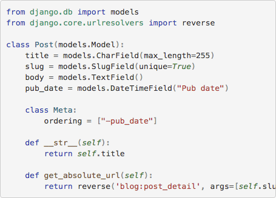

.. _index:
.. module:: pygmentify

Django Pygmentify
*****************

|PyPI version|_ |Build status|_

.. |PyPI version| image::
   https://badge.fury.io/py/django-pygmentify.svg
.. _PyPI version: https://pypi.python.org/pypi/django-pygmentify

.. |Build status| image::
   https://travis-ci.org/richardcornish/django-pygmentify.svg?branch=master
.. _Build status: https://travis-ci.org/richardcornish/django-pygmentify

**Django Pygmentify** is a `Django <https://www.djangoproject.com/>`_ `template tag <https://docs.djangoproject.com/en/1.11/howto/custom-template-tags/>`_ application to highlight code with `Pygments <http://pygments.org/>`_.

It is an alternative to `Django Pygments <https://github.com/od-eon/django-pygments>`_, which hasn't been updated in several years.

* `Package distribution <https://pypi.python.org/pypi/django-pygmentify>`_
* `Code repository <https://github.com/richardcornish/django-pygmentify>`_
* `Documentation <https://django-pygmentify.readthedocs.io/>`_
* `Tests <https://travis-ci.org/richardcornish/django-pygmentify>`_

Install
=======

.. code-block:: bash

   $ pip install django-pygmentify

Add to ``settings.py``.

.. code-block:: python

   INSTALLED_APPS = [
       # ...
       'pygmentify',
   ]

Usage
=====

.. code-block:: html

   

   <link rel="stylesheet" href="">
   
   
   <pre class="python">
   print('Hello, world!')
   </pre>
   

Result:

.. code-block:: html

   <link rel="stylesheet" href="/static/pygmentify/css/default.min.css">

   
<pre class="python">print(&quot;Hello, world!&quot;)
   </pre>

Upgrading
=========

The syntax of the template tags `changed <https://github.com/richardcornish/django-pygmentify/commit/0e73db8f220304f9c496b7d43c2e1586bbaf59eb>`_ in version 0.3.0 from a template filter (````) to a more robust template tag (````). Consult the `documentation <https://django-pygmentify.readthedocs.io/en/latest/usage.html>`_ for usage instructions.

Contents
========

.. toctree::
   :maxdepth: 2

   install
   usage
   settings
   documentation
   tests

Indices and tables
==================

* :ref:`genindex`
* :ref:`modindex`
* :ref:`search`
